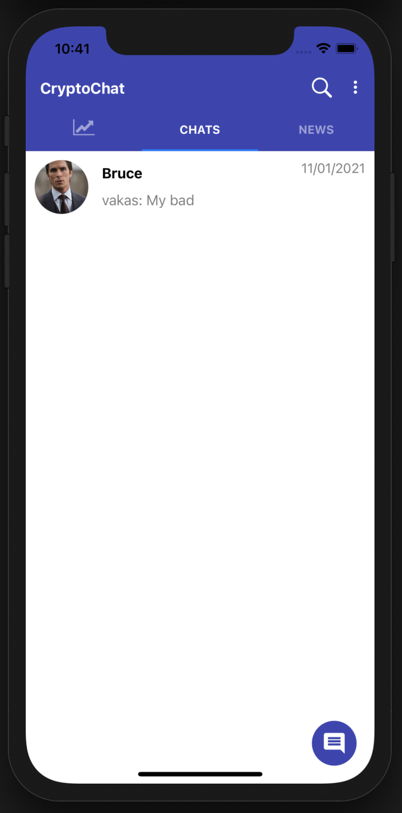
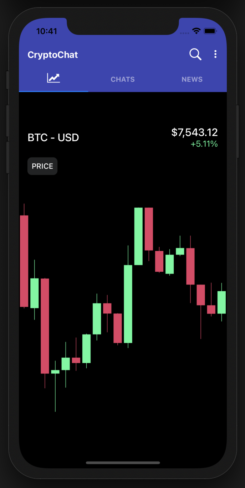
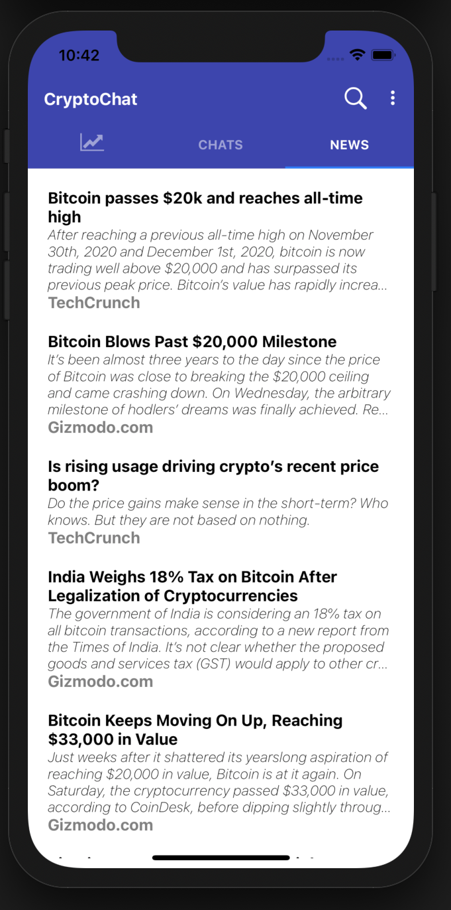

# CryptoChat - A Cryptocurrency Themed Messaging App
A messaging app built with a react native front end and an AWS Amplify GraphQL API backend. Users can also view cryptocurrency news as well as a candlestick chart that displays historical Bitcoin price data. You can view a demo of the app <a href='https://youtu.be/BD5KywSTqPM'>here.</a> 
## Screenshots 

    
    
    

